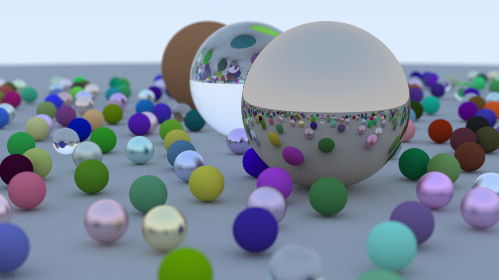

# Rust ray tracer

A minimal, functional 3D ray tracing renderer build in Rust.




## Running
```
git clone git@github.com:rpajo/rust-raytracing.git
cd rust-raytracing/
cargo run -r
```

## Features
- [x] Anti-aliasing
- [x] Basic Vec3 module and utilities
- [x] Configurable camera
- [x] Lambert, metallic materials
- [x] Glass material with refraction
- [x] Anti-aliasing
- [x] Depth of field blur

## References
- https://raytracing.github.io/
- https://www.scratchapixel.com/lessons/3d-basic-rendering/minimal-ray-tracer-rendering-simple-shapes/parametric-and-implicit-surfaces.html
- https://github.com/bevyengine/bevy
